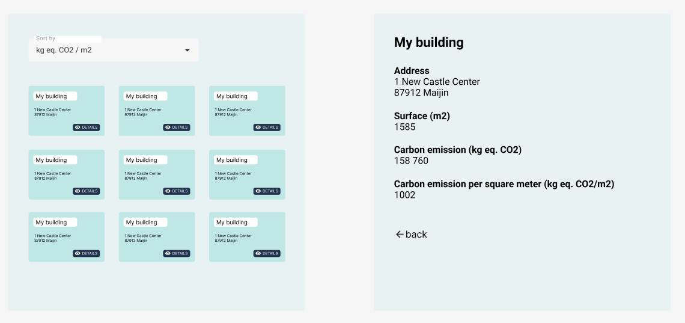

# Test Vizcab
Test Vizcab is a web interface designed to display a list of buildings under construction. 
Users can sort these buildings by either carbon emissions per square meter or by building surface area. 
Clicking on a building in the list will redirect users to a page presenting its characteristics.

# Installation
To get started with the Test Vizcab project, follow these steps:

1.Clone the repository: git@github.com:Sigma-2000/Test-Vizcab.git
2.Navigate to the project directory: Test-Vizcab\frontend
3.Install the dependencies: npm install

# Script
Once the dependencies are installed, you can run the following scripts:

-npm run dev: Starts the development server using Vite.
-npm run build: Builds the project using Vite for production.
-npm run lint: Lints JavaScript/JSX files using ESLint to ensure code quality.
-npm run test: Executes the vitest test runner.
-npm run coverage: Generates test coverage reports using vitest.

# Technologies Used
-Vite + React: Fast, opinionated web dev build tool and JavaScript library for building user interfaces.
-React Router Dom: DOM bindings for React Router, enabling declarative routing in React applications.
-JSX (JavaScript XML): A syntax extension for JavaScript often used with React to describe the UI.
-CSS3: Used for styling and design purposes.
-ESLint: A pluggable JavaScript linter for maintaining code quality.
-React Testing Library: A testing utility for React that focuses on testing React components by simulating how users interact with the application.
-Vitest: A test runner for Vite-powered applications, facilitating testing processes within the Vite ecosystem.
-GitHub Actions (CI): CI/CD pipelines are set up using GitHub Actions, automating build, test, and deployment processes directly within the GitHub repository.

## Mockup

For reference, you can use this mockup to develop your application:

